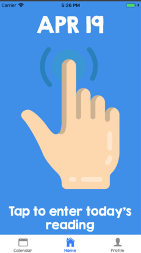

# NephroticNotebookApp
A ionic mobile app developed for patient with nephrotic disease to record daily protein test result and track medication.

This is a mobile app developed as part of my Design module at UCL. We worked in a group of three people on UI design, software engineering, database, programming and testing. The app, called 'My Nephrotic Notebook', is developed for patients at Great Ormond Street Hospital (GOSH) to replace their existing protein test logging sheet. Based on the protein level, patients undergo different treatment states (normal, relapse and remission) which require various amount of medication. The app is compatible for iOS and Android devices.

This project is owned by University College London and Great Ormond Street Hopsital (GOSH). Our work has been highly recognized by our client, GOSH, who appreciates the appealing design, great functionalities and reliable performance of our app.

Features:
- Patient profile and medical contact maintenance
- Input of other medications to assist diagnosis
- Input of prescriptions by physician for different treatment states
- Daily protein test result input and automatic treatment state calculation
- Recommendation on prescription dose (amount and interval) for prednisolone based on today's input and treatment state
- Calendar view of input history on monthly and daily basis (real-time update)
- Export of testing result in csv format and sharing via email

Technology stack:
- Ionic Framework v4.12 , Angular v7.3
- Front-end: Sketch and Balsamiq wireframe, HTML, CSS, Javascript
- Back-end: SQLite3, Ionic Storage, Ionic SQLite

Plugins used:
- Ionic4-date-picker for calendar functionality
- cordova-plugin-email-composer for email functionality
- cordova-plugin-file for file storage on device
- papaparse for csv file handling

Development:
- User requirement and UI Design
  - MoSCoW framework was adopted to define user requirements and set development priorities.
  - We used storyboard, Balsamiq wireframe and Sketch to create multiple versions of UI for user consultation and improve our     design. 
- Front-end Development
  - Given that our target customers are children age between 2 and 18, a lot of work was put on creating user-friendly           interfaces through the use of user-intuitive and colourful graphics rather than texts.
  - HTML, CSS and Javascript (Typescript) are used on top of ionic/angular framework.
  - Lazy loading is achieved via ionic framework to minimize app loading time.
- Back-end Development
  - SQLite3 is chosen to build in-device storage for user profile, prescription plans and test result input history.
  - Ionic Storage is used for saving temporary data during app usage.
- Testing
  - Testing covers every aspect of the app up to actual deployment.
  - Compatibility Testing was performed for various iOS and Android devices using Xcode and Android Studio. Our app works well with different screen sizes with minor text clippings in latest iOS devices.
  - Stress Testing was conducted by creating dummy daily input data over a period of 7 years (over 2000 records). 
  - User Acceptance Testing with 10 user cases was conducted with favourable user feedback.
